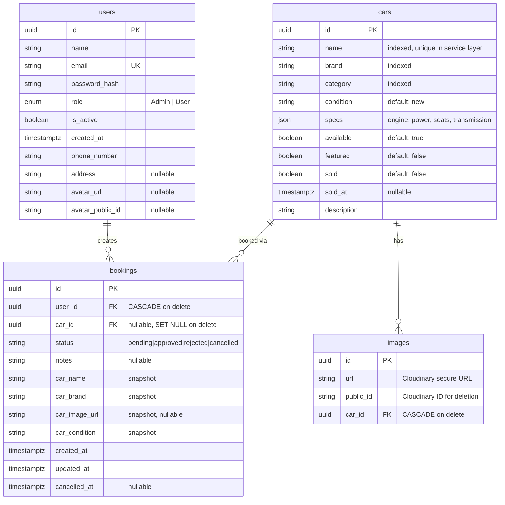
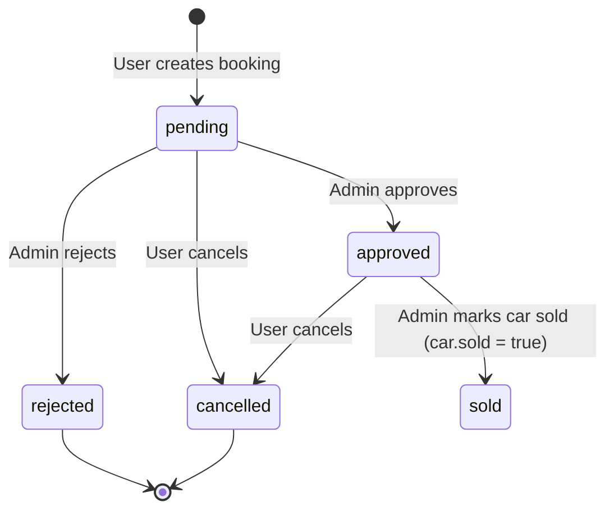

# Database Schema

[← Back to index](README.md)

## ER Diagram

## Relationship Summary

| Parent | Child | Cardinality | On Delete | Notes |
|--------|-------|-------------|-----------|-------|
| `users` | `bookings` | 1 → many | CASCADE | Deleting a user deletes their bookings |
| `cars` | `bookings` | 1 → many | SET NULL | Purged cars leave bookings with `car_id = NULL` but snapshots remain |
| `cars` | `images` | 1 → many | CASCADE | Images deleted when car is deleted |

## Table: `users`

**Model:** `models/users.py`

| Column | Type | Notes |
|--------|------|-------|
| `id` | UUID PK | Auto-generated |
| `name` | String | Required |
| `email` | String | Unique, indexed |
| `password_hash` | String | Argon2 hash, never expose |
| `role` | Enum | `Admin` or `User`; defaults to `User` |
| `is_active` | Boolean | Defaults `True`; inactive users cannot authenticate |
| `created_at` | Timestamptz | Server default `now()` |
| `phone_number` | String | Required at registration |
| `address` | String | Optional |
| `avatar_url` | String | Cloudinary URL |
| `avatar_public_id` | String | For Cloudinary cleanup |

## Table: `cars`

**Model:** `models/cars.py`

| Column | Type | Notes |
|--------|------|-------|
| `id` | UUID PK | `gen_random_uuid()` server default |
| `name` | String | Unique enforced in `services/cars.py` |
| `brand` | String | Indexed |
| `category` | String | e.g. `supercar`, `luxury_sedan`, `sports`, `premium_suv` |
| `condition` | String | Default `"new"` |
| `specs` | JSON | `{engine, power, seats, transmission}` |
| `available` | Boolean | Set `False` when sold |
| `featured` | Boolean | For homepage highlights |
| `sold` | Boolean | Triggers 48h visibility window |
| `sold_at` | Timestamptz | Set when marked sold |
| `description` | String | Free text |

## Table: `images`

**Model:** `models/images.py`

| Column | Type | Notes |
|--------|------|-------|
| `id` | UUID PK | |
| `url` | String | Cloudinary `secure_url` |
| `public_id` | String | Required for `cloudinary.uploader.destroy()` |
| `car_id` | UUID FK | References `cars.id` |

## Table: `bookings`

**Model:** `models/bookings.py`

| Column | Type | Notes |
|--------|------|-------|
| `id` | UUID PK | |
| `user_id` | UUID FK | Owner of the booking |
| `car_id` | UUID FK | Nullable after car purge |
| `status` | String(20) | See status machine below |
| `notes` | String | User inquiry message |
| `car_name` | String | **Snapshot** at booking time |
| `car_brand` | String | **Snapshot** |
| `car_image_url` | String | **Snapshot** of first car image |
| `car_condition` | String | **Snapshot** |
| `created_at` | Timestamptz | |
| `updated_at` | Timestamptz | Auto-updated |
| `cancelled_at` | Timestamptz | Set on user cancel |

> **Important:** Booking rows store car metadata as snapshots so history survives car deletion. Never rely solely on `booking.car` for display of past bookings — use snapshot fields when `car_id` is NULL.

## Booking Status Machine

| Status | Meaning | Transitions allowed |
|--------|---------|---------------------|
| `pending` | Awaiting admin review | → `approved`, `rejected`, `cancelled` |
| `approved` | Admin accepted inquiry | → `cancelled`, car can be marked sold |
| `rejected` | Admin declined | Terminal |
| `cancelled` | User withdrew | Terminal |

**Open statuses** (used for duplicate detection): `pending`, `approved`

## Related Docs

- [Business flows →](flows.md)
- [Schema migrations →](operations.md#schema-migrations)
- [Database rules →](rules.md#database-rules)
