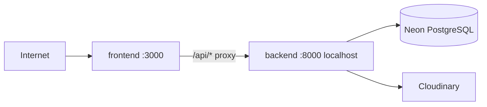

# Docker

[← Back to index](README.md)

## Files

| File | Purpose |
|------|---------|
| `Dockerfile` | Single image — FastAPI backend + Next.js frontend |
| `docker-entrypoint.sh` | Starts backend (internal) and frontend (public) |
| `backend/.env.example` | Backend secrets and config |

## Architecture



- Only **port 3000** is exposed.
- Backend listens on **127.0.0.1:8000** inside the container — the Next.js app proxies `/api/*` to it.
- Database stays on **Neon** (external).

---

## Build and run

1. Copy and fill env file:

```bash
cp backend/.env.example backend/.env
```

```env
DATABASE_URL=postgresql://...
JWT_SECRET=your-long-random-secret
CLOUDINARY_CLOUD_NAME=...
CLOUDINARY_API_KEY=...
CLOUDINARY_API_SECRET=...
FRONTEND_URL=http://localhost:3000
```

2. Build and start:

```bash
docker build -t eccelso .
docker run --rm -p 3000:3000 --env-file backend/.env eccelso
```

| URL | Service |
|-----|---------|
| http://localhost:3000 | Frontend (and `/api/*` via proxy) |

For production, set `FRONTEND_URL` to your public URL (e.g. `https://yourdomain.com`) and put a reverse proxy (Caddy, nginx, or your host’s load balancer) in front of port 3000 for HTTPS.

---

## Environment checklist

| Variable | Where | Purpose |
|----------|-------|---------|
| `DATABASE_URL` | `backend/.env` | PostgreSQL (Neon) |
| `JWT_SECRET` | `backend/.env` | JWT signing |
| `CLOUDINARY_*` | `backend/.env` | Image uploads |
| `FRONTEND_URL` | `backend/.env` | CORS origin |
| `BACKEND_URL` | Built into image | `http://127.0.0.1:8000` (internal proxy target) |

---

## Related Docs

- [Environment variables →](operations.md)
- [Authentication →](auth.md)
