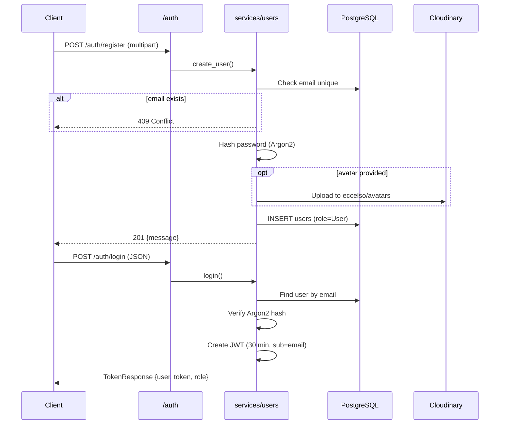
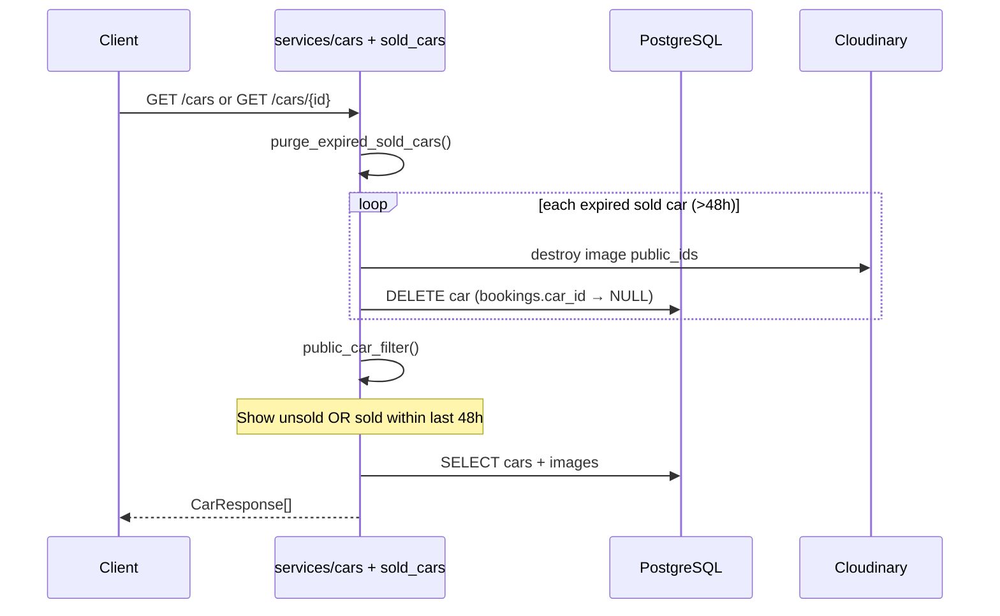
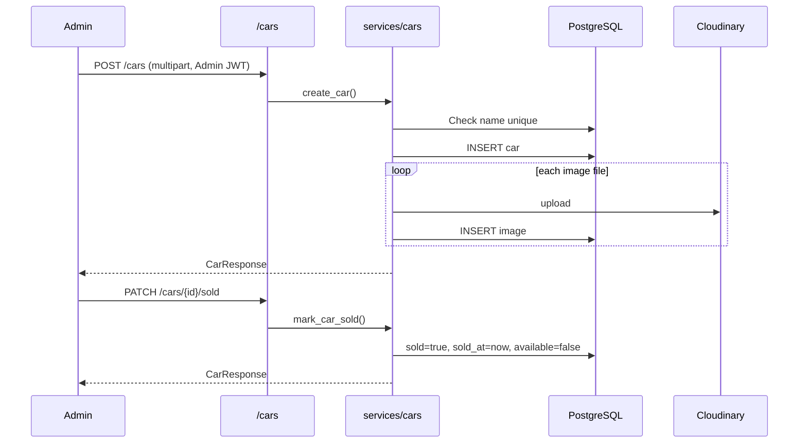
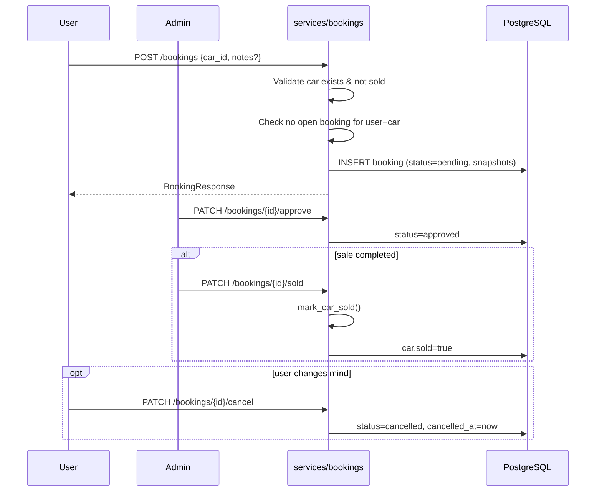

# Business Flows

[← Back to index](README.md)

## User Registration & Login



## Public Car Catalog



**Sold car visibility rule:** `SOLD_VISIBILITY_HOURS = 48` in `services/sold_cars.py`

## Admin Car Management



## Booking Lifecycle



## Sold Car Purge

Runs automatically before most car/booking reads — not a cron job.

```
Trigger: list_cars, get_car, create_booking, list_user_bookings, etc.
Condition: car.sold = true AND car.sold_at < now - 48 hours
Actions:
  1. Delete all images from Cloudinary (by public_id)
  2. DELETE car from DB
  3. Related bookings: car_id becomes NULL (FK SET NULL)
  4. Booking snapshots (car_name, car_brand, etc.) preserved
```

## Related Docs

- [Database schema →](database.md)
- [API endpoints →](api.md)
- [Sold car rules →](rules.md#sold-car-rules)
